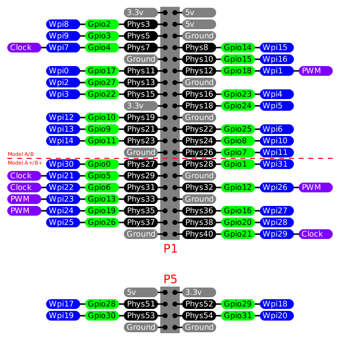

# ros-ircam-led

Control LED using ROS Topics:

you need to install first the WiringPi library for the Raspberry Pi:

# 1- Download WiringPi:
 `git clone https://github.com/WiringPi/WiringPi.git`

# 2- Install:

 `cd WiringPi`
 
 `./build`
 
# 3- Build your workspace:

* Copy the folder 'led' to your catkin workspace src folder.
* build the workspace using `catkin_make`

# 4- WiringPi vs GPIO Pin Numbering Tables:

